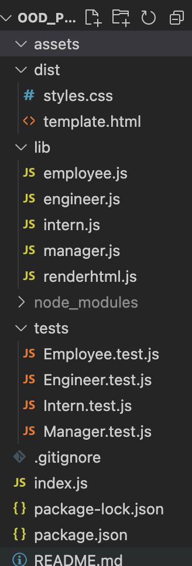

# OOD_Profile_Generator

**What does this application do and why**

* As an employee or manager, it is helpful to have a list of current team members and their information. This application helps solve this problem.
* This app uses node.js to ask necessary questions about each employee
* Using the information given, it generates an html page that has a card with important information about a fellow employee/team member

**How the application is organized**

OOD_Profile_Generator is organized into the following files:

**Installation**

* install node.js
* install necessary applications by using "npm i" in the command line
* use node.js to answer the questions, as seen below
* open team.html file to see newly created team profile

**Step by step on how to run the application**

* Open an integrated termial from index.js
* run node.js with this file
* Answer the questions given your employees, add as many as you like
* A new html file called team.html will be available to see

**What the application looks like**

[Link to Video of Application]https://watch.screencastify.com/v/knC6oZAktoQIFNcv5E5O

**Link to deployed version of Chandler's Portfolio**

GitHub Repository:

**Technologies Used** 
* html
* javascript
* inquirer
* jest
